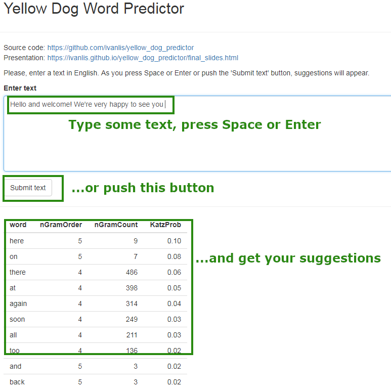

```{r setup, include=FALSE}
knitr::opts_chunk$set(echo = FALSE)
```

## How the model works

- Based on n-grams extracted from ... MB of text
- Database contains:
 - ... 1-grams
 - ... 2-grams
 - ... 3-grams
 - ... 4-grams
 - ... 5-grams
- *Katz backoff* used:
 - allows to combine different n-gram orders
 - handles unknown n-grams

## How the model works

- Consider the last 4 words entered by the user: $w_{1}w_{2}w_{3}w_{4}$.
- Search for 5-grams $w_{1}w_{2}w_{3}w_{4}\xi$.
Take the (Katz) conditional probabilities of the found words
$p = P(\xi | w_{1}w_{2}w_{3}w_{4})$.
- Search for 4-grams $w_{2}w_{3}w_{4}\xi$.
Multiply the Katz probabilities by a correction coefficient $\alpha_{4}$: $p = \alpha_{4}P(\xi | w_{2}w_{3}w_{4})$.
- Search for 3-grams $w_{3}w_{4}\xi$.
Multiply their Katz probabilities by another coefficient: $p = \alpha_{3}\alpha_{4}P(\xi | w_{3}w_{4})$.
- Do similar things for 2-grams: $p = \alpha_{2}\alpha_{3}\alpha_{4}P(\xi | w_{4})$.
- Sort by p (decreasing), eliminate duplicates (keep the suggestion produced by the highest order n-gram).

## Performance

The final model was tested on an unknown testing set (text):

- Cross-entropy:
- Perplexity:
- In ... of the cases the right word was in the top-3 
of suggested words.

## Product Architecture

Three components:

- In-memory database: tables of 1-, ..., 5-grams
- R code for the Katz backoff (the server side of the Shiny app)
- Web interface (the UI side of the Shiny app)

Try it out here: [https://ivanlis.shinyapps.io/yellow_dog/](https://ivanlis.shinyapps.io/yellow_dog/)

## Web interface: very easy to use

```{r out.width = "65%", fig.align="center"}

```
